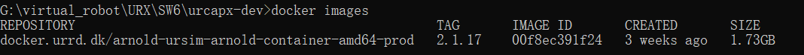
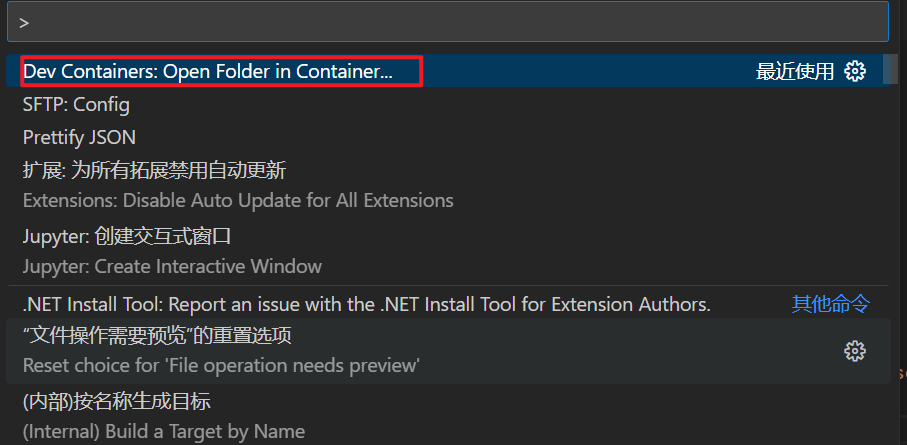

# docker-learning


#### Docker的概念

是一个开源的应用容器引擎，沙箱机制，相互隔离

#### Docker命令

启动docker：systemctl start docker

查看本地镜像：docker images

#### LXC与docker

##### LXC

​		LXC相当于C++中的NameSpace提供了一个拥有自己进程和网络空间的虚拟环境，但又有别于虚拟机，lxc是一种操作系统层次上的资源的虚拟化。

##### LXC和docker的区别

​		docker并不是LXC替代品，docker底层使用了LXC来实现，LXC将linux进程沙盒化，使得进程之间相互隔离，并且能对各进程资源合理分配。 在LXC的基础之上，docker提供了一系列更强大的功能。

##### docker

​		docker可以让开发者打包他们的应用以及依赖包到一个轻量级、可移植的容器中，然后发布到任何流行的linux服务器，也可以实现虚拟化。

#### 容器与虚拟机

​		容器是在linux上本机运行，并与其他容器共享主机的内核，它运行的**一个独立的进程**，不占用其他任何可执行文件的内存，非常轻量。 虚拟机运行的是一个完整的操作系统，通过虚拟机管理程序对主机资源进行虚拟访问，相比之下需要的资源更多。

#### docker三要素

##### image镜像

​		docker镜像就是一个只读模板

##### container容器

​		可以把容器看做是要给简易版的linux环境（包括root用户权限、镜像空间、用户空间和网络空间等）和运行在其中的应用程序

##### repostory仓库

​		这里仓库的概念与Git类似，registry可以理解为github这样的托管服务

### 关于如何使用URSim

#### 安装必要软件

首先需要安装以下两个软件

* Docker Desktop

> 具体怎么用不太清楚，但是在安装docker desktop的时候会把docker的环境装好，估计第一次配置之后可以在docker desktop中直接启动镜像；
>
> 安装好之后一般需要更新wsl,指令：wsl --update,因为属于微软服务，所以可能需要翻墙，至少我在另一个Windows虚拟机里不翻墙不能成功


> 安装过程中若遇到问题可查看以下链接
>
> https://blog.csdn.net/weixin_42222436/article/details/125945225

* VSCode或者其他IDE

> 可以看java以及进入容器中

#### 启动URSim

先打开docker desktop，保证docker在运行

启动cmd，路径到urcapx-dev下，


接下来就是docker的一些指令了，具体可以百度

首先是加载docker，指令⬇

```dockerfile
docker load -i arnold-ursim-arnold-container-amd64-prod.2.1.17.tar
```

这时候我们已经可以在docker desktop里看到这个镜像了，


可以用

```dockerfile
docker images 
```

查看本地镜像，



随后启动镜像，启动的镜像名用ID代替就行了

```dockerfile
docker run --privileged --rm --add-host=servicegateway:127.0.0.1 -it -p 5900:5900 -p 6080:6080 00f8ec391f24
```


至此，镜像启动结束。

### 关于PolyScope

对于示教器，现在只能通过VNC或者网页版的VNC

VNC对应端口:5900   IP：127.0.0.1

Web VNC：http://localhost:6080/vnc.html

### 关于URCap部署

#### 打开容器

对于URCap，需要load另一个docker，依然是在urcapx-dev的路径下

```dockerfile
cd urcapx-dev  # 保证在该路径下
docker load -i urcap-dev.0.4.10		# 加载docker
```

加载之后，用vscode打开urcapx-dev文件夹，

需要安装的插件

* Docker
* Dev Containers

安装完插件之后重启vscode，按Ctrl + Shift + P选择




打开文件夹之后相当于是远程连接上了容器中的服务器，原理还不知道

之后打开终端ctrl+j就能发现路径已经在这个容器里面了


#### 复制原来的URCap

文件结构发生变化：

所有所需的文件，ur管这些所有叫artifacts，不知道咋翻译

文件架构直接截图如下：

-->

* Move the folder "daemon" into the created "daemon-cpp" folder. 

* Move the content of the folder "src\main\resources\com\ur\urcap\examples\mydaemonswing\impl\daemon\hello-world.py" into the created 

"daemon-py" folder. 

* Move the rest of the old project into the "polyscope-ui" folder
* The names of these folders depends to you.
* LICENSE and manifest.yaml are both necessary

```yaml
apiVersion: urcaps/v1.0
metadata:
  vendorID: universal-robots
  urcapID: mydaemonswing
  version: v1.0
  vendorName: Universal Robots
  urcapName: My Daemon Swing
  contactInfo: Energivej 25, 5260 Odense S, Denmark
  description: Daemon Sample URCap
  startup: manual
  copyright: Copyright (c) 2009-2023 Universal Robots. All rights reserved.
  licenseType: Sample license
artifacts:
  # containers:
  # - name: daemon-cpp
  #   image: daemon-cpp:1.0
  #   ingress:
  #     - name: xmlrpc
  #       port: 40405
  #       protocol: http
  #       proxyUrl: /
  # - name: daemon-py
  #   image: daemon-py:1.0
  #   ingress:
  #     - name: xmlrpc
  #       port: 40405
  #       protocol: http
  #       proxyUrl: /
  osgiBundles:
  - name: polyscope-ui		# 这个名字必须和你文件夹的名字相同
    bundle: polyscope-ui-1.0-SNAPSHOT.jar	
```

需要注意格式，以及如果没有daemon需要注释掉containers中的daemon-cpp项和daemon-py项


剩下的东西就是先版本对于老版本改动的地方了，需要根据文档进行改动，有pom.xml和一些API需要改动

#### 编译

改动之后即可编译

```dockerfile
pwd  # /workspaces/urcapx-dev
urcapctl build [urcap_src_dir] [urcapx_dst_dir]
# example: urcapctl build dockerdaemon .
```

之后得先启动URSim，只有启动之后才能部署进去，


#### 部署

```dockerfile
pwd  # /workspaces/urcapx-dev
urcapctl deploy [dst_ip_address] [path_to_urcapx]
# example: urcapctl deploy 172.17.0.2 dockerdaemon.urcapx
```

替换

```dockerfile
urcapctl deploy [dst_ip_address] [path_to_urcapx] --replace
# example: urcapctl deploy 172.17.0.2 dockerdaemon.urcapx --replace
```

#### 查看

需要重启URSim，可以直接Stop之后再run，


### 无关紧要

**docker容器中的devcontainer和dockerfile有什么作用**

`devcontainer` 和 `Dockerfile` 是 Docker 中常用的两个概念，分别用于创建和管理容器。

`devcontainer` 是一个开发环境的 Docker 容器，用于在容器中编写、测试和调试代码。它通常具有所需的开发工具和库，以便您可以在容器中安全和隔离的环境中工作。

`Dockerfile` 是一个文本文件，用于描述如何创建一个 Docker 容器。它通过指定容器中所需的镜像、环境变量、端口映射等来定义容器。您可以使用 Dockerfile 自动创建和管理容器，以便重复使用定义好的容器环境。

因此，如果您是一个开发人员，则可以使用 `devcontainer` 来创建安全、隔离的开发环境，并使用 `Dockerfile` 来描述该环境的所有组成部分。

**docker中devcontainer.json文件有什么作用**

`devcontainer.json` 文件是用于描述 `devcontainer` 的配置文件。它是一个 JSON 格式的文件，用于指定 devcontainer 的一系列设置，如使用的镜像、环境变量、端口映射等。

当您使用 Visual Studio Code 等工具创建 devcontainer 时，该工具会创建一个 `devcontainer.json` 文件，以便您可以管理和配置 devcontainer。您可以打开该文件，并在其中指定所需的设置，以创建与您的开发需求完全一致的 devcontainer。

通过使用 `devcontainer.json` 文件，您可以很方便地管理和配置 devcontainer，从而更容易地使用它们进行开发。


